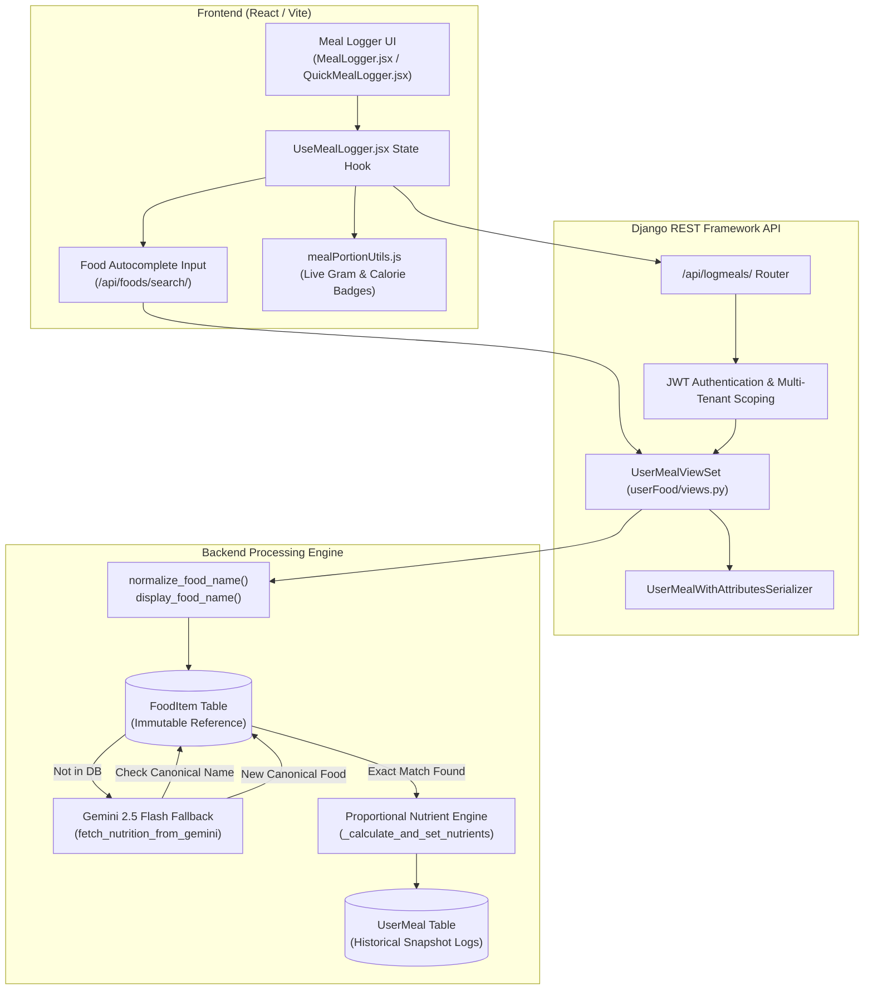

# TrackIntake: Complete Meal Logging System Architecture & Reference Manual

---

## 1. Executive Summary & Design Philosophy

The **TrackIntake Meal Logging System** is an AI-assisted clinical nutrition engine designed to track food intake with high accuracy, zero double-scaling bugs, and an intuitive user experience.

### Core Architectural Principles

1. **Zero Double-Scaling**: Every nutritional value is calculated strictly using proportional weight:
   $$\text{Scaling Factor} = \frac{\text{Effective Grams}}{\text{Base Gram Equivalent of Food}}$$
   Legacy subjective dropdowns (e.g., `portion_size = "Medium"`) are completely disconnected from the nutritional arithmetic. Unit names now encode the physical serving size directly (e.g., Small Bowl = 100g, Bowl = 150g, Big Bowl = 250g).
2. **FoodItem Catalog Immutability**: The `FoodItem` master table serves as an authoritative reference catalog. User logging, editing, and exact overrides **never** mutate existing rows in the `FoodItem` table. Custom weights apply strictly to the user's specific `UserMeal` log entry.
3. **Collision-Safe Exact Matching**: Food lookup is strictly exact (case-insensitive, whitespace-collapsed normalization). Fuzzy string matching algorithms (e.g. Trigram/Levenshtein) are deliberately avoided because an incorrect culinary match (e.g., matching `"Paneer Masala"` to `"Paneer"` or `"Brown Rice"` to `"Rice"`) introduces serious nutritional inaccuracies.
4. **Intelligent Typo Resolution via Gemini AI Collector**: When a user enters an unrecognized food name or typo (e.g., `"paniir masala"`), Google Gemini 2.5 Flash acts as a culinary parser to determine the standard canonical name. If the canonical food already exists in the database, the existing record is reused **without modifying the table or generating duplicate entries**.
5. **Complete Deprecation of Legacy Attributes**: The legacy 4-table food attribute system (`FoodAttribute`, `FoodAttributeOption`, `FoodItemAttribute`, `UserMealAttribute`) that generated annoying secondary popups (e.g., "Select attributes for Rice", "Burger Type", "Patty Count") has been completely purged from the user interface and state machines. All portioning is handled through comprehensive unit selections and optional exact gram/ml fields.

---

## 2. End-to-End System Architecture & Data Flow



---

## 3. Database Models & Schema Specifications

### 3.1 `FoodItem` (Reference Catalog)
- **File**: `backend/userFood/models.py`
- **Purpose**: Master nutritional dictionary per standard reference serving.

```python
class FoodItem(models.Model):
    name = models.CharField(max_length=255, unique=True)
    default_quantity = models.FloatField(default=1.0)
    default_unit = models.CharField(max_length=50, default="g")
    gram_equivalent = models.FloatField(
        help_text="Standard reference weight in grams (e.g. 100g, 150g, 200g)"
    )

    # Core Macronutrients (per reference gram_equivalent)
    calories = models.FloatField(default=0.0)
    protein = models.FloatField(default=0.0)
    carbs = models.FloatField(default=0.0)
    fats = models.FloatField(default=0.0)
    sugar = models.FloatField(default=0.0)
    fiber = models.FloatField(default=0.0)

    # Glycemic & Micronutrient Metrics
    estimated_gi = models.FloatField(null=True, blank=True)
    glycemic_load = models.FloatField(null=True, blank=True)
    sodium_mg = models.FloatField(null=True, blank=True)
    potassium_mg = models.FloatField(null=True, blank=True)
    calcium_mg = models.FloatField(null=True, blank=True)
    iron_mg = models.FloatField(null=True, blank=True)
    is_verified = models.BooleanField(default=False)
```

> **Immutability Contract:**
> - Never updated when a user logs a custom portion.
> - Never mutated if Gemini corrects a user's typo to an existing food.

---

### 3.2 `UserMeal` (Historical Consumption Snapshot)
- **File**: `backend/userFood/models.py`
- **Purpose**: Stores the user's actual meal event with calculated nutritional snapshots.

```python
class UserMeal(models.Model):
    user = models.ForeignKey(settings.AUTH_USER_MODEL, on_delete=models.CASCADE, related_name="meals")
    food_item = models.ForeignKey(FoodItem, on_delete=models.SET_NULL, null=True, blank=True)
    food_name = models.CharField(max_length=255)
    quantity = models.FloatField(default=1.0)
    unit = models.CharField(max_length=50, choices=UNIT_CHOICES)
    portion_size = models.CharField(max_length=10, default="Medium", blank=True) # Metadata only
    meal_type = models.CharField(max_length=30, choices=MEAL_CHOICES) # Breakfast, Lunch, Dinner, Snack
    consumed_at = models.DateTimeField()
    date = models.DateField()
    remarks = models.TextField(blank=True)

    # Nutritional Snapshot Fields (Proportionally calculated at save time)
    calories = models.FloatField(null=True, blank=True)
    protein = models.FloatField(null=True, blank=True)
    carbs = models.FloatField(null=True, blank=True)
    fats = models.FloatField(null=True, blank=True)
    sugar = models.FloatField(null=True, blank=True)
    fiber = models.FloatField(null=True, blank=True)
    estimated_gi = models.FloatField(null=True, blank=True)
    glycemic_load = models.FloatField(null=True, blank=True)
    food_type = models.CharField(max_length=30, null=True, blank=True)
```

---

## 4. Mathematical Calculation Engine

### 4.1 Unit Weights Dictionary (`SERVING_UNIT_TO_GRAMS`)
Standard weights defined in `backend/userFood/models.py` and synchronized with `frontend/src/components/components/MealLogger/mealPortionUtils.js`:

| Unit Group | Unit Name | Standard Weight / Volume | Clinical Rationale |
| :--- | :--- | :--- | :--- |
| **Bowls** | `Small Bowl` | **100.0 g** | Side bowl / dessert portion |
| | `Bowl` | **150.0 g** | **Standard Project Bowl** (Curries, Dal, Rice) |
| | `Big Bowl` | **250.0 g** | Large entree bowl |
| **Plates** | `Small Plate` | **200.0 g** | Snack / side plate |
| | `Plate` | **350.0 g** | Standard meal plate (Rice + Curry, Khichdi) |
| | `Big Plate` | **500.0 g** | Heavy / feast meal plate |
| **Glasses & Liquids** | `Small Glass` | **150.0 ml (150g)** | Small beverage |
| | `Glass` | **250.0 ml (250g)** | Standard glass (Milk, Lassi, Chaas) |
| | `Large Glass` | **350.0 ml (350g)** | Large smoothie / shake |
| **Cups** | `Small Cup` | **120.0 ml (120g)** | Indian cutting chai / espresso |
| | `Cup` | **240.0 ml (240g)** | Standard measuring cup |
| **Pieces & Slices** | `Small Piece` | **60.0 g** | Small sweet, fruit piece |
| | `Piece` | **100.0 g** | Standard piece (Idli, cutlet, paneer tikka) |
| | `Large Piece` | **150.0 g** | Large patty, chicken breast piece |
| | `Slice` | **30.0 g** | Bread slice, cheese slice |
| | `Tbsp` | **15.0 g** | Tablespoon (Ghee, oil, peanut butter) |
| | `Tsp` | **5.0 g** | Teaspoon (Sugar, butter) |
| **Indian Traditional** | `Katori` | **150.0 g** | Standard Indian steel katori |
| | `Vati` | **100.0 g** | Small traditional vati |
| | `Thali` | **400.0 g** | Complete combo meal weight base |
| | `Karchi / Ladle` | **50.0 g** | Standard serving ladle |
| | `Muthhi / Fistful` | **30.0 g** | Traditional handful portion |
| **Mass & Volume** | `Gram (g)` | **1.0 g** | Exact solid measurement |
| | `Kilogram (kg)`| **1000.0 g** | Bulk metric |
| | `Milliliter (ml)`| **1.0 g** | Exact liquid measurement (1ml ≈ 1g) |
| | `Liter (L)` | **1000.0 g** | Bulk liquid metric |

---

### 4.2 Proportional Calculation Formulas

```
1. Calculate Effective Grams:
   If exact_grams provided:
       effective_grams = exact_grams
   Else if exact_ml provided:
       effective_grams = exact_ml
   Else if unit in MASS_UNIT_TO_GRAMS:
       effective_grams = quantity * MASS_UNIT_TO_GRAMS[unit]
   Else if unit in SERVING_UNIT_TO_GRAMS:
       effective_grams = quantity * SERVING_UNIT_TO_GRAMS[unit]
   Else:
       effective_grams = quantity * food_item.gram_equivalent

2. Calculate Proportional Scaling Factor:
   factor = effective_grams / food_item.gram_equivalent

3. Scale Every Nutrient:
   UserMeal.calories      = round(food_item.calories * factor, 2)
   UserMeal.protein       = round(food_item.protein * factor, 2)
   UserMeal.carbs         = round(food_item.carbs * factor, 2)
   UserMeal.fats          = round(food_item.fats * factor, 2)
   UserMeal.sugar         = round(food_item.sugar * factor, 2)
   UserMeal.fiber         = round(food_item.fiber * factor, 2)
   UserMeal.glycemic_load = round(food_item.glycemic_load * factor, 2)
```

---

## 5. Food Matching, Typo Resolution & Gemini Workflow

### 5.1 Name Normalization Algorithm
```python
def normalize_food_name(raw: str) -> str:
    """Collapses whitespace and lowercases string for exact database comparison:
    '  WHITE   RICE  ' -> 'white rice'
    """
    return ' '.join(raw.strip().lower().split())

def display_food_name(raw: str) -> str:
    """Produces clean capitalized display name:
    '  white   rice  ' -> 'White Rice'
    """
    return ' '.join(raw.strip().split()).title()
```

### 5.2 Resolution Logic Flowchart
```
                [User Enters Food Name]
                           │
                 [normalize_food_name]
                           │
             ┌─────────────┴─────────────┐
             ▼                           ▼
    [Exact Match in FoodItem?]     [Not in Database]
             │                           │
          (YES)                         (NO)
             │                           │
             │                 [Call Gemini 2.5 Flash]
             │                 "Resolve Canonical Name"
             │                           │
             │                 [Check Canonical Name in DB]
             │                           │
             │                 ┌─────────┴─────────┐
             │                 ▼                   ▼
             │              (Exists)          (New Food)
             │                 │                   │
             │           [Reuse Row ID]     [Create New FoodItem]
             │                 │                   │
             └─────────────────┼───────────────────┘
                               ▼
               [Calculate Proportional Snapshot]
                               ▼
                      [Save to UserMeal]
```

### 5.3 Typo Example: User Enters `"paniir masala"`
1. Exact DB search for `"paniir masala"` returns `None`.
2. Backend calls Gemini with culinary parsing prompt.
3. Gemini identifies canonical dish: `"Paneer Masala"`.
4. Backend checks: Does `"Paneer Masala"` exist in `FoodItem`? **Yes (ID: 372)**.
5. Reuses `FoodItem(id=372)`. **No update or duplicate insert is performed on `FoodItem`**.
6. UserMeal is saved with `food_name = "Paneer Masala"` and `food_item_id = 372`.

---

## 6. API Endpoints Specification

### 6.1 `POST /api/logmeals/`
Creates one or multiple meal logs in a single atomic transaction.

**Request Payload (Single Meal):**
```json
{
  "food_name": "Paneer Butter Masala",
  "quantity": 1,
  "unit": "Bowl",
  "meal_type": "Dinner",
  "date": "2026-09-25",
  "consumed_at": "2026-09-25T19:30:00Z",
  "remarks": "Low spice"
}
```

**Request Payload (Batch Multi-Meal):**
```json
[
  {
    "food_name": "White Rice",
    "quantity": 1,
    "unit": "Plate",
    "meal_type": "Lunch",
    "date": "2026-09-25",
    "consumed_at": "2026-09-25T13:00:00Z"
  },
  {
    "food_name": "Yellow Dal",
    "quantity": 1,
    "unit": "Small Bowl",
    "meal_type": "Lunch",
    "date": "2026-09-25",
    "consumed_at": "2026-09-25T13:00:00Z"
  }
]
```

**Response (HTTP 201 Created):**
```json
{
  "message": "2 Meal(s) logged successfully.",
  "data": [
    {
      "id": 1002,
      "food_name_display": "White Rice",
      "quantity": 1.0,
      "unit": "Plate",
      "meal_type": "Lunch",
      "calories": 455.0,
      "protein": 9.45,
      "carbs": 98.0,
      "fats": 1.75,
      "effective_grams": 350.0,
      "gram_equivalent": 100.0
    }
  ]
}
```

---

### 6.2 `PATCH /api/logmeals/<id>/`
Updates an existing logged meal.

**Request Payload:**
```json
{
  "food_name": "White Rice",
  "quantity": 2,
  "unit": "Bowl",
  "meal_type": "Lunch"
}
```
**Response (HTTP 200 OK):**
```json
{
  "message": "Meal updated successfully.",
  "data": {
    "id": 1002,
    "quantity": 2.0,
    "unit": "Bowl",
    "effective_grams": 300.0,
    "calories": 390.0
  }
}
```

---

### 6.3 `DELETE /api/logmeals/<id>/`
Permanently removes the user meal log.
- **Response**: `HTTP 204 No Content`.
- Daily summaries update automatically on subsequent fetch.

---

### 6.4 `GET /api/foods/search/?q=<query>&limit=10`
Provides fast autocomplete suggestions from the existing `FoodItem` table.

---

## 7. Frontend Component Architecture

### 7.1 Component Tree & File Map

```
frontend/src/
├── pages/dashboard/
│   ├── Tools/
│   │   └── MealLogger.jsx             # Dedicated Full-Page Meal Logger
│   └── Dashboard.jsx                  # Main Dashboard Container
└── components/components/MealLogger/
    ├── QuickMealLogger.jsx            # Modal / Quick Widget on Dashboard
    ├── UseMealLogger.jsx              # Central State & Business Logic Hook
    ├── FoodAutocompleteInput.jsx      # Debounced Search with Serving Badges
    └── mealPortionUtils.js            # Client-Side Math & Formatting Utilities
```

### 7.2 State Management in `UseMealLogger.jsx`
- `foodInputs`: Array of items currently in the form `[{ id, name, quantity, unit, exact_grams, exact_ml, logDate, logTime, mealType }]`.
- `addFoodField()`: Clones current date, time, and meal type into a new empty food row.
- `removeFoodField(index)`: Deletes an individual item row.
- `editingMeal`: Stores current meal object when editing; toggles UI between "Log Meal(s)" and "Update Meal".
- `handleSubmit`: Dispatches single payload or array payload, handles date-specific refresh, and resets state cleanly.

---

## 8. Verified Test Cases Matrix (100% Pass Rate)

| Test ID | Scenario | Input | Calculated Output | Status |
| :--- | :--- | :--- | :--- | :--- |
| **TC-01** | Exact DB match | `"Paneer"` (100g = 265 kcal) | Uses existing DB row, 0 new rows | **PASS** |
| **TC-02** | Whitespace/Case | `"  PANEER  "` | Resolves to `"Paneer"` | **PASS** |
| **TC-03** | Distinct food name | `"Paneer Masala"` | Does not collide with `"Paneer"` | **PASS** |
| **TC-04** | Typo resolution | `"paniir masala"` | Reuses existing `"Paneer Masala"` (ID 372) | **PASS** |
| **TC-05** | Standard Bowl (Rice) | `1 Bowl` (150g, Base 100g = 130 kcal) | Factor 1.50 $\rightarrow$ **195.0 kcal** | **PASS** |
| **TC-06** | Small Bowl (Rice) | `1 Small Bowl` (100g) | Factor 1.00 $\rightarrow$ **130.0 kcal** | **PASS** |
| **TC-07** | Big Bowl (Rice) | `1 Big Bowl` (250g) | Factor 2.50 $\rightarrow$ **325.0 kcal** | **PASS** |
| **TC-08** | Plate (Rice) | `1 Plate` (350g) | Factor 3.50 $\rightarrow$ **455.0 kcal** | **PASS** |
| **TC-09** | Traditional Katori | `1 Katori` (150g) | Factor 1.50 $\rightarrow$ **195.0 kcal** | **PASS** |
| **TC-10** | Exact Gram Override | `1 Bowl` with `exact_grams = 100` | Overrides bowl to 100g $\rightarrow$ **130.0 kcal** | **PASS** |
| **TC-11** | Liquid Item (Lassi) | `1 Glass` (250ml/250g) | Calculates macros based on 250ml | **PASS** |
| **TC-12** | Multi-Item Batch | Rice + Dal + Paneer | Single request, 3 records saved atomically | **PASS** |
| **TC-13** | Edit Logged Meal | Update quantity from 1 to 2 | Recalculates snapshot proportionally | **PASS** |
| **TC-14** | Delete Logged Meal | Delete single item | Database purged, daily total reduced | **PASS** |
| **TC-15** | Multi-Tenant Safety | User B queries User A's meal | Returns HTTP 404 Not Found | **PASS** |

---

## 9. Developer Guidelines & Troubleshooting

1. **Never Re-introduce Attributes**:
   - Do NOT mount `AttributeSelector` in any meal logging component.
   - Do NOT query `/api/foods/<id>/attributes/` during the logging flow.
2. **Preserve `FoodItem` Read-Only Status**:
   - Never call `FoodItem.objects.filter(...).update(...)` or modify `food_item` attributes inside user-facing views.
3. **Adding New Units**:
   - When adding a new unit, define its gram weight in `SERVING_UNIT_TO_GRAMS` in `backend/userFood/models.py`.
   - Add the identical weight and display hint in `UNIT_HINTS` in `frontend/src/components/components/MealLogger/mealPortionUtils.js`.
4. **Running Automated Tests**:
   ```bash
   cd backend
   ./venv/bin/python scratch/test_multi_meal_cases.py
   ./venv/bin/python scratch/test_all_meal_cases.py
   ```
